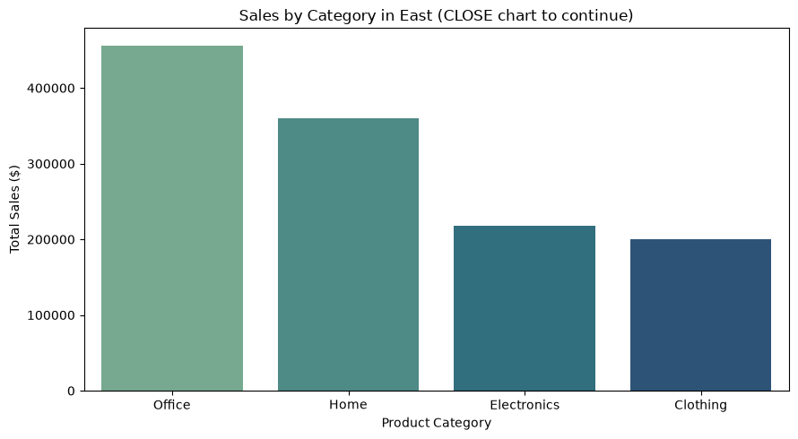
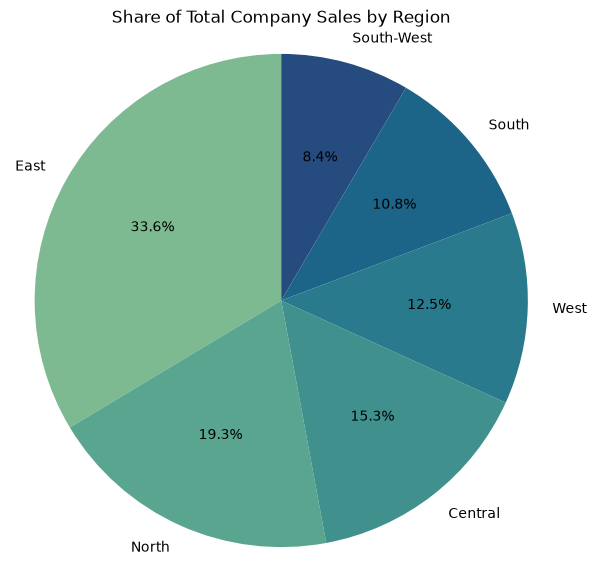
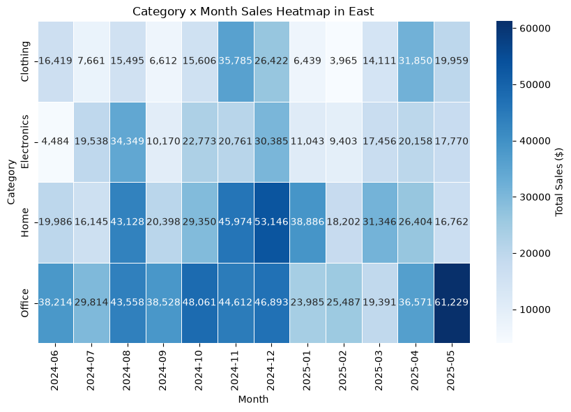

# Project Documentation

This site provides project documentation.
Use the documentation navigation to explore.

## How-To Guide

Many instructions are common to all our projects.

See
[⭐ **Workflow: Apply Example**](https://denisecase.github.io/pro-analytics-02/workflow-b-apply-example-project/)
to get the example projects running on your machine.

## Project Documentation Pages (docs/)

- **Home** - this documentation landing page
- [**Project Instructions**](./project-instructions.md) - the standard project workflow
- [**Your Files**](./your-files.md) - how to copy the example and create your version
- [**Glossary**](./glossary.md) - project terms and concepts
- [**API**](./api.md) - autogenerated code documentation for the public project interface

## Example Storytelling Question

The example project answers this business question:

> Which product category contributes the most sales in the selected region,
> and when are its sales strongest?

The example follows a general BI storytelling process:

1. Define one clear business question.
2. Identify the data needed to answer it.
3. Summarize the data.
4. Create charts that provide evidence.
5. Identify the most important results.
6. Explain the findings in your documentation.
7. Recommend an action or next question.

Your project should follow the same general process,
but answer a different business question.

## Phase 4. Technical Modification

**What you changed:**
In `storytelling_jugurtha.py`, I changed the color palette used in the first chart (`plot_bar()` for category sales by region) from `"Blues_d"` to `"crest"`.

```python
palette="Blues_d",   # before
palette="crest",      # after
```

**Why you chose that change:**
It's a small, low-risk, purely visual change — it doesn't touch any data logic, function signatures, or business results, so it's a safe way to demonstrate editing a working project without breaking anything. It also made the chart easier to read against the docs page background, since `crest` has more contrast between bars than `Blues_d` did.

**How you verified that it worked:**
I re-ran the script with `uv run python -m bizintel.storytelling_jugurtha`, confirmed it completed without errors, and opened the regenerated `docs/images/storytelling_category_sales_jugurtha.png` to visually compare it against the previous version.

**What result, output, chart, metric, or behavior confirmed the change:**
The category sales bar chart now renders in the `crest` colormap (teal-to-blue gradient) instead of the original `Blues_d` gradient. No log output, values, or file names changed — only the chart's appearance. The `TotalSales` figures, category ordering, and file path (`storytelling_category_sales_case.png`) all stayed identical, confirming the change was purely cosmetic and isolated.

**Compared with the example project, explain what is different and why the change matters:**
The underlying data pipeline — loading, filtering, grouping, and aggregating — is completely unchanged from the original example. The only difference is one keyword argument passed into `plot_bar()`. This matters because it shows the separation between the *analysis logic* (which stayed untouched and trustworthy) and the *presentation layer* (which can be safely tuned without risking the correctness of the underlying numbers) — an important distinction in BI work.

**Was it easy, or surprisingly challenging and why do you think so?**
Easy. Because `plot_bar()` already exposed `palette` as a named parameter, the change was a one-line edit with no ripple effects elsewhere in the file. The main thing to double check was that `"crest"` is a valid seaborn palette name, since an invalid string would only fail at runtime rather than at edit time.

---

## Phase 5. Custom Project

### Basis and Problem

I used the same reporting-ready dataset as the example project: `data/reporting/sales_reporting_case.csv`. I queried the full table (no need for the raw warehouse tables — this file is already the reporting-ready output of that earlier stage) and used four columns:

- **Region** — the categorical dimension used to compare markets against each other
- **Category** — the categorical dimension used to compare product lines within a region
- **YearMonth** — the time dimension used to see when sales occur
- **SaleAmount** — the numeric measure summed to produce total sales

These columns are relevant because the business goal is to understand *where* (region), *what* (category), and *when* (month) sales are concentrated — the three dimensions needed to both size an opportunity and act on it.


### Business Question

> What share of total company sales does the East region represent compared to other regions, and within East, which category/month combinations drive the strongest and weakest performance?

This matters because it answers two levels of a common business concern at once: *is East worth the attention it's getting* (relative to other regions), and *if so, where inside East should effort be focused or reinforced* (which category, which season). The result could support a decision about regional resourcing — for example, whether to increase East's marketing budget, and if so, which category and time of year to target the spend for maximum effect. The concrete **action** it supports is: if East is a large, growing share of the business, allocate more inventory/marketing spend to its strongest category ahead of its strongest month; if a category is consistently weak across all months in the heatmap, consider whether to discontinue or reposition it in that region.

### Analysis Approach

- I did **not** filter for the first chart — I grouped the *entire* reporting dataset by `Region` and summed `SaleAmount`, so every region could be compared on equal footing.
- For the second chart, I **filtered (sliced)** the data down to `Region == "East"` only, then grouped by two dimensions at once — `Category` and `YearMonth` — using a pivot table, with `SaleAmount` summed as the measure.
- The first chart (regional share) doesn't need a strict sort since a pie chart shows proportion visually, but the underlying `df_regional_sales` table is sorted descending by `TotalSales` so East's rank among regions is clear at a glance.
- The second chart's month columns are sorted chronologically (not by value) so seasonal patterns can be read left to right.
- The first result (East's overall share of company sales) is what justifies drilling into East specifically for the second chart — this is the same "compare, then drill down" pattern as the example project, just using a pie chart + heatmap instead of a bar chart + line chart.
- **Charts created:** a pie chart of total sales share by region, and a heatmap of Category × Month sales within East.

### Charts and Evidence

**Chart 1 — Share of Total Company Sales by Region** (`docs/images/storytelling_regional_share_jugurtha.png`)
A pie chart with a clear title ("Share of Total Company Sales by Region"), percentage labels on each slice, and one wedge per region. This chart provides the evidence for the first half of the business question — it shows exactly what fraction of total company revenue East contributes relative to every other region, establishing whether East deserves the deeper look that follows.

**Chart 2 — Category × Month Sales Heatmap in East** (`docs/images/storytelling_category_month_heatmap_jugurtha.png`)
A heatmap with categories on the y-axis, months on the x-axis (labeled "Month" and "Category"), a titled color scale ("Total Sales ($)"), and annotated cell values for readability. This chart provides the evidence for the second half of the business question — it shows, cell by cell, exactly which category is strongest and which is weakest in every month within East, revealing seasonal patterns that a single-category line chart would miss.




### Findings and Recommendation

- **Main result:** East represents 33.6% of total company sales, making it the 1st largest region. Within East, Office is strongest in May 2025, while Clothing is weakest across nearly all months."
- **Recommended action:** Increase inventory and marketing spend for East's Office ahead of its strongest month; investigate why the weakest category underperforms across the heatmap. We could consider a promotion, repricing, or discontinuing it in that region.
- **Next question:** Does the weakest category in East also underperform in other regions, or is this an East-specific problem?

### Storytelling Summary

This project started from the same reporting-ready sales dataset as the example project, but asked a different, two-part question: how big a piece of the company East represents, and where inside East the real strengths and weaknesses sit month by month. The pie chart delivered the "how big" answer at a glance, and the heatmap turned that single regional number into an actionable map of category-by-month performance. Together they demonstrate the core BI storytelling pattern — start broad (compare all regions), then drill into the one that matters (East's categories and months) — so a decision-maker can go from "where should I look" to "what should I do about it" in two charts. More generally, this shows how BI storytelling turns a flat CSV into a narrative that supports a specific, defensible business action rather than just presenting numbers.

1. Chart showing the initial comparison: **Share of Total Company Sales by Region** (pie chart)

2. Chart showing the deeper analysis: **Category × Month Sales Heatmap in East** (heatmap)

